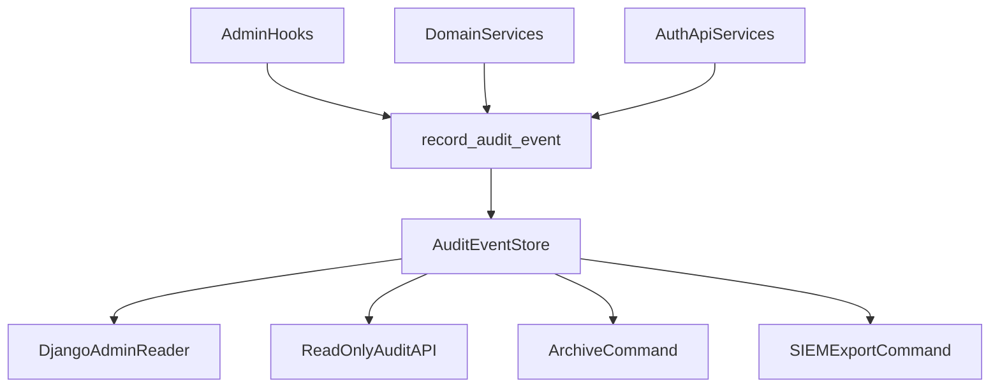

# Audit Architecture (`apps/common`)

## Zielbild

Die Audit-Architektur soll sicherstellen, dass sicherheits- und betriebsrelevante
Zustandsaenderungen nachvollziehbar, reproduzierbar und kontrolliert auswertbar sind.
Sie folgt den Leitplanken aus:

- `docs/engineering/backend.md`
- `docs/engineering/security.md`
- `docs/engineering/testing.md`
- `docs/engineering/api.md`

## Architekturbausteine

- **Event Store (`AuditEvent`)**: persistente, strukturierte Ereignisse.
- **Write Gateway (`record_audit_event`)**: validiert und sanitisiert Events zentral.
- **Producers**:
  - Admin-Hooks (`AdminAuditTrailMixin`)
  - Domain-Services (expliziter Service-Aufruf)
  - API-/Auth-/Permission-Services in implementierten Apps (z. B. `accounts`)
- **Reader**:
  - Django Admin
  - Read-only Audit API (`AuditEventViewSet`) fuer autorisierte Rollen
  - SIEM-Exportpfad ueber Management Command

## Datenfluss

## Event-Schema (Mindeststandard)

Pflichtfelder:

- `action`
- `target_model`
- `target_id`
- `actor` (falls vorhanden)
- `created_at`

Empfohlene Kontextfelder:

- `metadata.source`
- `metadata.changes` (bei Updates)
- `ip_address`
- `user_agent`
- offen: `metadata.request_id` / `metadata.trace_id`

## Integritaetsmodell

### Aktuell

- Hash-Kette je Event (`previous_hash` -> `integrity_hash`) im zentralen Write-Gateway.
- Append-only Enforcement auf `AuditEvent` (Update/Delete blockiert).

### Offene Härtungen

- Externer Signaturnachweis (z. B. KMS/Hardware-Key) fuer nicht-abstreitbare Beweiskette.
- WORM-/Object-Lock-Strategie fuer langzeitstabile Aufbewahrung.
- Regelmaessige Integritaets-Verifikation als betrieblicher Kontrollpunkt.

## Verantwortlichkeiten

- **Services** erzeugen fachliche Audit-Events.
- **Admin-Mixin** erzeugt technische Admin-Audit-Events.
- **Permissions-Schicht** steuert Zugriff auf Auditdaten bei API-Expose.
- **Operations** verantwortet Retention, Monitoring, Incident-Reaktionsfaehigkeit.

## Nicht-Ziele (Stand heute)

- Keine Garantie, dass alle kritischen Domain-Flows bereits auditiert sind.
- Kein vollstaendig auditiertes Reader-Audit (wer hat Auditdaten gelesen).

## Querverweise

- Gap-Analyse: `docs/backend/common/audit-gap-analysis.md`
- Security/Privacy: `docs/backend/common/audit-security-privacy.md`
- Betrieb: `docs/backend/common/audit-operations.md`
- Roadmap: `docs/backend/common/audit-roadmap.md`
- Engineering Security: `docs/engineering/security.md`
- Engineering Backend: `docs/engineering/backend.md`
- Engineering Testing: `docs/engineering/testing.md`
- Engineering API: `docs/engineering/api.md`
