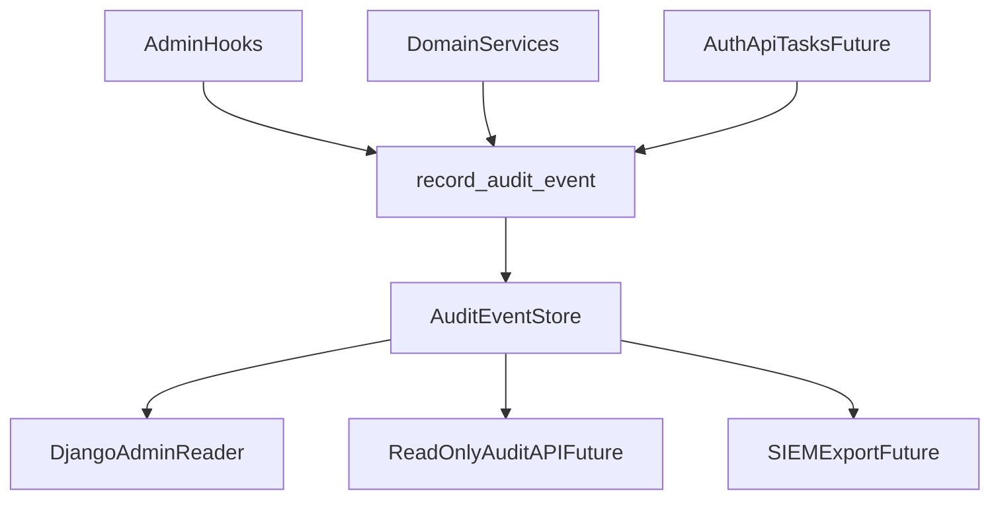

# Audit Architecture (`apps/common`)

## Zielbild

Die Audit-Architektur soll sicherstellen, dass sicherheits- und betriebsrelevante
Zustandsaenderungen nachvollziehbar, reproduzierbar und kontrolliert auswertbar sind.
Sie folgt den Leitplanken aus:

- `docs/engineering/backend.md`
- `docs/engineering/security.md`
- `docs/engineering/testing.md`
- `docs/engineering/api.md`

## Architekturbausteine

- **Event Store (`AuditEvent`)**: persistente, strukturierte Ereignisse.
- **Write Gateway (`record_audit_event`)**: validiert und sanitisiert Events zentral.
- **Producers**:
  - Admin-Hooks (`AdminAuditTrailMixin`)
  - Domain-Services (expliziter Service-Aufruf)
  - spaeter: API-/Auth-/Task-Events
- **Reader**:
  - Django Admin
  - spaeter: read-only Audit API fuer autorisierte Rollen

## Datenfluss

## Event-Schema (Mindeststandard)

Pflichtfelder:

- `action`
- `target_model`
- `target_id`
- `actor` (falls vorhanden)
- `created_at`

Empfohlene Kontextfelder:

- `metadata.source`
- `metadata.changes` (bei Updates)
- `ip_address`
- `user_agent`
- spaeter: `metadata.request_id` / `metadata.trace_id`

## Integritaetsmodell

### Aktuell

- Standard-DB-Speicherung ohne formalen Tamper-Proof-Mechanismus.

### Zielrichtung

- Entscheidung zwischen:
  - append-only DB-Policy
  - tamper-evident Nachweis (Hash-Kette / Signatur)
- Integritaetsstrategie muss in `audit-roadmap.md` geplant und per Test/Runbook verifiziert werden.

## Verantwortlichkeiten

- **Services** erzeugen fachliche Audit-Events.
- **Admin-Mixin** erzeugt technische Admin-Audit-Events.
- **Permissions-Schicht** steuert Zugriff auf Auditdaten bei API-Expose.
- **Operations** verantwortet Retention, Monitoring, Incident-Reaktionsfaehigkeit.

## Nicht-Ziele (Stand heute)

- Keine Garantie, dass alle kritischen Domain-Flows bereits auditiert sind.
- Kein vollstaendiger SIEM-Export im aktuellen Stand.

## Querverweise

- Gap-Analyse: `docs/backend/common/audit-gap-analysis.md`
- Security/Privacy: `docs/backend/common/audit-security-privacy.md`
- Betrieb: `docs/backend/common/audit-operations.md`
- Roadmap: `docs/backend/common/audit-roadmap.md`
