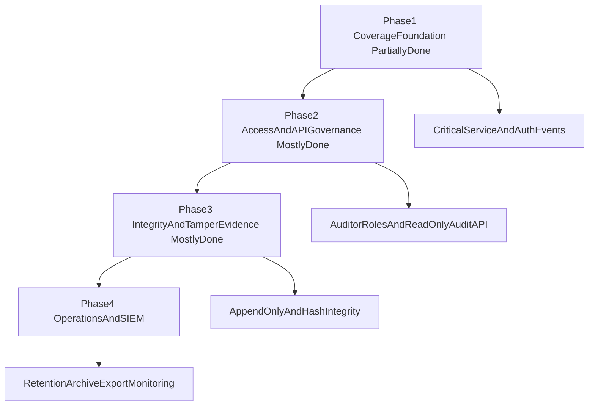

# Audit Roadmap (`apps/common`)

## Ziel

Phasenweiser Ausbau der Auditierung von der bestehenden Basis zu einem enterprise-faehigen
Standard mit SOC2/ISO-orientierten Kontrollzielen.

## Prinzipien

- Kleine, reviewbare Schritte mit klaren Akzeptanzkriterien.
- Sicherheits- und Permission-Aspekte pro Phase explizit testen.
- API/OpenAPI-Pflichten nur dort aktivieren, wo Audit-Endpunkte eingefuehrt werden.

## Phasenplan

## Aktueller Phasenstatus

- **Phase 1 (Coverage Foundation):** teilweise umgesetzt
  - umgesetzt: zentrale Event-Konventionen + Service-basierte Events in vorhandenen Flows
  - offen: flächige Coverage fuer alle kritischen Domain-Flows
- **Phase 2 (Access & API Governance):** weitgehend umgesetzt
  - umgesetzt: read-only Audit API + Permission-Gate + Schema
  - offen: dediziertes Auditor-Rollenmodell statt einzelner Berechtigungen
- **Phase 3 (Integrity & Tamper Evidence):** weitgehend umgesetzt
  - umgesetzt: Hash-Kette + append-only Enforcement
  - offen: externe Signatur-/WORM-Härtung und regelmaessige Integritaetsverifikation
- **Phase 4 (Operations & SIEM):** teilweise umgesetzt
  - umgesetzt: Archiv- und SIEM-Commands inkl. Exportmarker
  - offen: Betriebs-SLOs, Alerts, Restore-Evidenz, produktive SIEM-Integration

## Phase 1: Coverage Foundation

### Ziel

Kritische Domain-/Auth-/Permission-Flows ausserhalb des Admins verbindlich auditieren.

### Technische Massnahmen

- `record_audit_event(...)` in relevanten Service-Flows verankern.
- Event-Taxonomie (`action`-Konventionen) pro Domäne verbindlich festlegen.
- Pflicht-Metadaten (`source`, optional `changes`) als Team-Standard etablieren.

### Risiken

- Unvollstaendige Coverage einzelner kritischer Pfade.
- Zu breite Metadaten erfassen sensible Daten.

### Verifikation

- Unit-Tests fuer Event-Erzeugung je Service.
- Integrationstests fuer kritische Workflows inkl. Fehler- und Permission-Faelle.
- Review-Checkliste gegen `docs/engineering/security.md`.

## Phase 2: Access & API Governance

### Ziel

Kontrollierter, read-only Zugriff auf Auditdaten mit klaren Rollen und API-Vertrag.

### Technische Massnahmen

- Auditor-Rolle und dedizierte Permissions einfuehren.
- Read-only Audit-API (List/Detail) mit Filter/Pagination aufbauen.
- OpenAPI-Schema in `api/v1/schema/` dokumentieren.

### OpenAPI-/Permission-Auswirkungen

- Endpoint-Verhalten, Auth und Fehlerfaelle muessen explizit dokumentiert sein.
- Objekt-/Use-Case-Permissions sind verpflichtend testbar umzusetzen.

### Verifikation

- API-Tests fuer Statuscodes, Response-Struktur, Validierungs- und Permission-Faelle.
- Schema-Validierung gemaess `docs/engineering/api.md`.

## Phase 3: Integrity & Tamper Evidence

### Ziel

Integritaetsnachweis fuer Auditdaten (tamper-evident oder append-only).

### Technische Massnahmen

- Architekturentscheidung fuer Integritaetsmodell:
  - append-only Enforcement
  - oder Hash-/Signaturstrategie
- Dokumentierte Betriebs- und Wiederherstellungsstrategie fuer Integritaetsnachweise.

### Risiken

- Hoher Migrationsaufwand auf bestehende Daten.
- Performance- und Betriebsimpact bei Integritaetspruefungen.

### Verifikation

- Integrations-/Property-Tests fuer Unveraenderbarkeitsregeln.
- Negative Tests (Manipulationsversuche muessen erkannt oder blockiert werden).

## Phase 4: Operations & SIEM

### Ziel

Betriebsreife Auditierung mit Retention, Archivierung, Monitoring und SIEM-Export.

### Technische Massnahmen

- Retention-Klassen und Loesch-/Archivregeln einfuehren.
- Monitoring/Alerting fuer Audit-Schreibpfade und Anomalien.
- Standardisierter Export in Security-Analytics-Pipeline.

### Risiken

- Fehlkonfigurierte Retention fuehrt zu Datenverlust oder Compliance-Risiko.
- Exportpfad kann sensible Daten unbeabsichtigt ausleiten.

### Verifikation

- Regelmaessige Restore-/Archivstichproben.
- Monitoring- und Alert-Checks als Betriebsakzeptanz.
- Integrationstests fuer Exportpfade mit Sanitization-Checks.

## Definition of Ready je Phase

- Scope und Akzeptanzkriterien sind schriftlich freigegeben.
- Teststrategie ist pro Phase spezifiziert.
- Security-Review fuer neue Datenfluesse ist eingeplant.

## Definition of Done je Phase

- Geplante Massnahmen umgesetzt und dokumentiert.
- Relevante Tests bestehen stabil.
- Querverweise in `docs/backend/common` und `docs/engineering` sind aktualisiert.

## Fokussierter Rest-Backlog (naechste Schritte)

1. Auditor-Rollenmodell und Audit-of-audit fuer Reader etablieren.
2. Request-/Trace-Korrelation in neuen Domain-Flows konsequent mitziehen und reviewen.
3. Integritaets-Härtung mit externem Signaturnachweis und periodischer Verifikation.
4. Betriebsreife fuer Archiv/SIEM: SLOs, Alerts, Restore-Drills, Evidenzkatalog.
5. Coverage-Gap-Closing fuer kritische Domain-Flows ausserhalb bereits umgesetzter Services.

## Querverweise

- Architektur: `docs/backend/common/audit-architecture.md`
- Security/Privacy: `docs/backend/common/audit-security-privacy.md`
- Betrieb: `docs/backend/common/audit-operations.md`
- Gap-Analyse: `docs/backend/common/audit-gap-analysis.md`
- Engineering Security: `docs/engineering/security.md`
- Engineering Backend: `docs/engineering/backend.md`
- Engineering Testing: `docs/engineering/testing.md`
- Engineering API: `docs/engineering/api.md`
